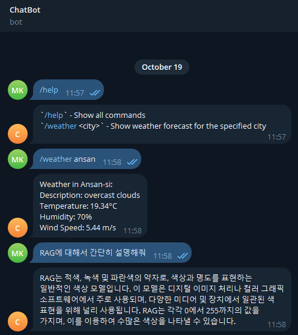

# Telegram_Chatbot

Telegram Chatbot

The Telegram bot was created by referring to the [official docs](https://docs.python-telegram-bot.org/en/v21.6/).

## Table of Contents

-   [Result](#result)
-   [Getting Started](#getting-started)
    -   [Install Libraries](#install-libraries)
    -   [Run a Bot](#run-a-bot)
    -   [Docker build and run](#docker-build-and-run)
-   [Reference](#reference)

## Result



## Getting Started

> **Environment Variables**

```
BOT_TOKEN=<Telegram-Bot-API-KEY>
OPENWEATHERMAP_API_KEY=<OpenWeatherMap-API-KEY>
OPENAI_API_KEY=<OpenAI-API-KEY>
```

> **Get Telegram Bot API**  
> [Tutorial Docs](https://core.telegram.org/bots/tutorial)

Creating a new bot  
Use the `/newbot` command to create a new bot. [@BotFather](https://t.me/botfather) will ask you for a name and username, then generate an authentication token for your new bot.

-   The **name** of your bot is displayed in contact details and elsewhere.

-   The **username** is a short name, used in search, mentions and t.me links. Usernames are 5-32 characters long and not case sensitive – but may only include Latin characters, numbers, and underscores. Your bot's username must end in 'bot’, like 'tetris_bot' or 'TetrisBot'.

-   The **token** is a string, like `110201543:AAHdqTcvCH1vGWJxfSeofSAs0K5PALDsaw`, which is required to authorize the bot and send requests to the Bot API. Keep your token secure and store it safely, it can be used by anyone to control your bot.

> **Get OpenWeather Map API**  
> [OpenWeather API Docs](https://openweathermap.org/)

> **Get ChatGPT API**  
> [GPT API Docs](https://platform.openai.com/docs/api-reference/introduction)

## Install Libraries

```bash
$ pip3 install -r requirements.txt
```

## Run a bot

```bash
$ python3 bot.py
```

## Docker build and run

```bash
$ docker-compose up --build
```

## Reference

-   [Telegram MarkdownV2 style](https://core.telegram.org/bots/api#markdownv2-style)
-   [Web search library](https://pypi.org/project/googlesearch-python/)
